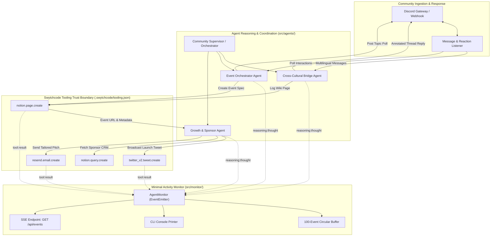

# AI Community Organizer Agent

### Autonomous Multi-Agent Community Operations Platform for Discord, Notion, X, and Resend

[](https://nodejs.org/)
[](https://www.typescriptlang.org/)
[](tests/)
[](dev/specs/spec_community_agents.md)
[](.swytchcode/tooling.json)
[](LICENSE)

---

## Executive Resume and Project Summary

The **AI Community Organizer Agent** is an autonomous multi-agent system designed for international developer organizations operating cross-border communities across multiple time zones and languages. Specifically engineered for the Antigravity Fan Club bridging Japan and India, the platform solves core operational challenges: cross-cultural language barriers, organizer burnout in event scheduling across IST and JST, multi-channel marketing, and sponsor relationship management.

By orchestrating Discord community interactions with Swytchcode tool contracts (`notion.page.create`, `notion.query.create`, `twitter_v2.tweet.create`, and `resend.email.create`), the agent performs closed-loop community operations. Real-time agent decisions, tool invocations, and execution metrics are streamed through a lightweight, zero-dependency in-memory `AgentMonitor` observable via CLI and Server-Sent Events (SSE).

### Technical Highlights

- **Multi-Agent Decoupled Architecture**: Coordinated by an overarching Supervisor, specialized agents handle cultural translation, event scheduling consensus, and outbound marketing pipelines.
- **Cross-Cultural Bridge Engine**: Script detection (Japanese Kanji/Kana, Hindi Devanagari, English Latin), entity recognition for holidays and festivals (Diwali, Obon, Golden Week), and bilingual cultural nuance annotations.
- **Closed-Loop Data Handoff**: Community voting tallies on Discord automatically feed into Notion event page creation, which triggers promotional social broadcasts on X and personalized sponsor pitches via Resend.
- **Resilient Dual Execution Mode**: Full support for live external credentials as well as zero-credential local mock execution (`DEMO_MODE=mock`) with 100% test coverage and offline reliability.
- **Zero-Dependency Observability**: Native Node.js `EventEmitter` broadcasting 5-field structured activity events with a 100-event circular ring buffer for browser SSE synchronization.

---

## Problem Statement Alignment

| Requirement ID | Problem Description | Target Pain Point | Implemented Solution |
| :--- | :--- | :--- | :--- |
| `REQ-01` | Multilingual friction across Japanese, Hindi, and English with messy chat history. | Misunderstandings, communication hesitations, context loss in international channels. | **Cross-Cultural Bridge Node**: Real-time language identification, cultural entity extraction, bidirectional translation, and community FAQ logging in Notion. |
| `REQ-02` | Time-zone friction and organizer fatigue in planning international meetups. | Inactive community schedules, mismatch between Indian Standard Time (UTC+5:30) and Japan Standard Time (UTC+9:00). | **Event Orchestrator Node**: Automated Discord topic and time-slot polls, reaction tallying, time-zone overlap calculation, and bilingual Notion event page generation. |
| `REQ-03` | Manual promotional overhead across social networks and sponsor outreach. | Low public visibility, fragmented sponsor communication, organizer burnout. | **Growth & Sponsor Outreach Node**: Closed-loop ingestion of Notion event pages to draft compliant X/Twitter announcements and dispatch targeted sponsor emails via Resend. |
| `REQ-04` | Black-box execution during demonstrations and judging reviews. | Evaluators cannot inspect agent reasoning, intermediate decisions, or tool payloads. | **Live Telemetry & Activity Streaming**: Structured event logs streamed over SSE (`GET /api/events`) and ANSI-formatted console mirroring. |
| `REQ-05` | Real-time community engagement and automated thread moderation on Discord. | High maintenance overhead, manual bot interactions, lack of thread auto-replies. | **Discord Subsystem**: Dual Bot and Webhook client with Discord Gateway listener, reaction tallying, rate-limit retries, and local mock transport. |
| `REQ-06` | Need for minimal, transparent visibility without external APM infrastructure. | Complex setup requirements, database overhead, potential observability failures. | **Minimal Agent Activity Monitor (`AgentMonitor`)**: In-memory event bus tracking thoughts, tool calls, and results without external databases. |

---

## System Architecture

The following diagram illustrates the interaction between Discord community channels, the multi-agent reasoning supervisor, the `AgentMonitor` telemetry layer, and the Swytchcode tool execution boundary.



---

## Multi-Agent Subsystems Deep Dive

### 1. Cross-Cultural Bridge Node (`src/agents/bridge_agent.ts`)
- **Script & Language Identification**: Detects Japanese (Hiragana/Katakana/Kanji), Hindi (Devanagari), and English (Latin).
- **Entity Extraction**: Recognizes cultural markers, holidays, and honorifics (e.g., Diwali, Holi, Obon, Golden Week, -san, Ji) with contextual explanatory glosses.
- **Bidirectional Annotation**: Translates content between Japanese and English, appending explanatory cultural context cards to ensure clear understanding without condescension.
- **Discord Integration**: Hooks directly into `ThreadResponder` to generate threaded contextual replies for monitored community channels.

### 2. Event Orchestrator Node (`src/agents/event_agent.ts`)
- **Bicultural Scheduling**: Evaluates viable meeting windows accounting for the 3.5-hour time difference between India Standard Time (UTC+5:30) and Japan Standard Time (UTC+9:00).
- **Interactive Polling**: Builds multi-choice polls with keycap emojis, seeds bot reactions, tallies member votes, and resolves ties deterministically based on option priority.
- **Notion Event Publishing**: Transforms agreed topics and schedules into formatted Notion event specifications ready for public registration.

### 3. Growth & Sponsor Outreach Node (`src/agents/growth_agent.ts`)
- **Automated Social Broadcast**: Composes concise tweets within character bounds (280 units), integrating bilingual tags (`#Antigravity`, `#IndoJapanTech`) and event links.
- **Sponsor CRM & Pitch Dispatch**: Queries target partner profiles from Notion and generates structured, professional outreach emails via Resend with dynamic company and recipient insertion.

### 4. Discord Agent Subsystem (`src/discord/`)
- **Dual Transport Protocol**:
  - `BotRestTransport`: Authenticated bot execution via Discord REST API supporting message creation, thread creation, reaction management, and automatic HTTP 429 rate-limit backoff.
  - `WebhookTransport`: Lightweight fallback delivery for environments where full bot credentials are not provisioned.
  - `MockDiscordTransport`: Full in-memory loopback transport for unit testing and offline demonstrations.
- **Gateway Listener**: Websocket client handling Discord Gateway handshake, heartbeat cycles, and message event routing.

### 5. Minimal Agent Activity Monitor (`src/monitor/`)
- **Lightweight Event Contract**: Standardized 5-field payload:
  ```typescript
  interface AgentActivityEvent {
    timestamp: string;      // ISO 8601 (HH:MM:SS)
    agent: string;          // Supervisor | Bridge | Event | Growth | Discord
    type: 'thought' | 'tool_call' | 'tool_result' | 'error' | 'status';
    summary: string;        // Human-readable summary for monitors
    details?: Record<string, unknown>; // Optional structured context
  }
  ```
- **Real-Time Streaming**: Dispatches live Server-Sent Events (SSE) via `GET /api/events` and prints colored terminal output.
- **History Replay**: Retains the most recent 100 events in a circular ring buffer to instantly populate new monitoring sessions.

---

## Swytchcode Tooling Integration

The platform adheres strictly to the Swytchcode declarative tooling contract defined in `.swytchcode/tooling.json`. All tool interactions pass through `SwyCliExecutor` (`src/swytchcode/executor.ts`), which interfaces with the Swytchcode CLI runner:

- `notion.page.create`: Creates cultural knowledge base entries and bilingual event specifications.
- `notion.query.create`: Retrieves sponsor databases and community member lists.
- `twitter_v2.tweet.create`: Publishes social announcements to X/Twitter.
- `resend.email.create`: Sends individualized sponsorship proposals and event updates.

In mock mode (`DEMO_MODE=mock`), `MockToolExecutor` provides deterministic, zero-latency responses that conform exactly to Swytchcode JSON schemas.

---

## Technology Stack

- **Runtime**: Node.js (>= 23.6) using ECMAScript Modules (ESM)
- **Language**: TypeScript 5.9 (Strict type configuration, zero-emit validation)
- **Testing**: Native Node.js Test Runner (`node:test`, `node:assert/strict`)
- **APIs & Tooling**: Swytchcode CLI, Notion API, Twitter API v2, Resend API, Discord API v10
- **Observability**: Native Node.js `EventEmitter` + Server-Sent Events (SSE)

---

## Repository Structure

```text
Swytchcode/
├── .agents/                    # Custom agent skills, rules, and workflows
│   ├── rules/PERSONA.md        # Architectural rules and standards
│   └── workflows/              # Standard execution workflows
├── .swytchcode/
│   └── tooling.json            # Swytchcode tool definitions and schemas
├── dev/
│   ├── context/                # Problem statements, tracks, and walkthroughs
│   ├── plans/                  # Implementation plans and task lists
│   └── specs/                  # Functional specifications and user stories
├── src/
│   ├── agents/                 # Domain agent implementations
│   │   ├── bridge_agent.ts     # Cultural translation and entity recognition
│   │   ├── event_agent.ts      # Discord polls and event page drafting
│   │   ├── growth_agent.ts     # Social media and email outreach
│   │   └── orchestrator.ts     # Multi-agent coordination loop
│   ├── config/                 # Environment configuration and tool registries
│   │   ├── env.ts              # Configuration loader and key validator
│   │   └── swytchcode_tools.ts # Tool ID mapping and registry
│   ├── discord/                # Discord gateway and transport implementations
│   │   ├── discord_client.ts   # Bot and webhook transport layer
│   │   ├── mock_discord.ts     # Mock transport for offline execution
│   │   ├── poll_handler.ts     # Interactive poll generator and tally
│   │   └── thread_responder.ts # Bilingual thread auto-responder
│   ├── monitor/                # Observability subsystem
│   │   ├── agent_monitor.ts    # In-memory event bus and circular buffer
│   │   ├── console_printer.ts  # ANSI terminal output formatter
│   │   └── sse_handler.ts      # Server-Sent Events HTTP streamer
│   └── swytchcode/             # Swytchcode tool executor and mocks
│       ├── executor.ts         # CLI stdio runner for Swytchcode tools
│       └── mock_executor.ts    # Schema-compliant mock executor
├── tests/                      # Automated test suite (58 passing tests)
│   ├── agent_flow.test.ts      # End-to-end multi-agent orchestration test
│   ├── agents.test.ts          # Domain agent unit tests
│   ├── discord.test.ts         # Discord transport and gateway tests
│   ├── monitor.test.ts         # Observability and SSE stream tests
│   └── setup.test.ts           # Configuration and tooling boundary tests
├── .env.example                # Template for environment configuration
├── package.json                # Project scripts and dependencies
├── README.md                   # System documentation and setup guide
└── tsconfig.json               # TypeScript strict configuration
```

---

## Getting Started

### Prerequisites

- **Node.js**: Version `23.6.0` or higher (required for native `--env-file-if-exists` and modern test runner capabilities). Check with:
  ```bash
  node --version
  ```
- **npm**: Version `10.0.0` or higher.
- **Swytchcode CLI** (Optional for live mode): Installable via standard Swytchcode tooling procedures.

### Installation

1. Clone the repository:
   ```bash
   git clone https://github.com/Ryosuke-Kawashima-Career/Swytchcode.git
   cd Swytchcode
   ```

2. Install dependencies:
   ```bash
   npm install
   ```

### Environment Configuration

The application operates in **Mock Mode** by default, requiring no external API credentials.

1. Copy the sample environment file:
   ```bash
   cp .env.example .env
   ```

2. Configure environment options in `.env`:

| Variable | Mode | Description |
| :--- | :--- | :--- |
| `DEMO_MODE` | Both | Set to `mock` (default, zero credentials) or `live` (invokes external APIs). |
| `PORT` | Both | Port for the local HTTP and SSE server (default: `3000`). |
| `SWYTCHCODE_TOKEN` | Live | Swytchcode authentication token for CLI tool execution. |
| `NOTION_DATABASE_ID` | Live | Target Notion database ID for events and cultural notes. |
| `NOTION_PARENT_PAGE_ID` | Live | Notion parent page ID under which new pages are nested. |
| `NOTION_API_VERSION` | Live | Notion API version header (default: `2025-09-03`). |
| `NOTION_SPONSOR_DATA_SOURCE_ID` | Live | Notion database ID containing sponsor CRM contacts. |
| `RESEND_FROM_EMAIL` | Live | Verified sender email address for Resend outbound mail. |
| `SPONSOR_REPORT_EMAIL` | Live | Internal contact address for sponsor status reporting. |
| `DISCORD_BOT_TOKEN` | Live | Discord bot token for Gateway connection and reaction monitoring. |
| `DISCORD_WEBHOOK_URL` | Live | Webhook URL for fallback message dispatching. |
| `DISCORD_GUILD_ID` | Live | Discord Server (Guild) ID. |
| `DISCORD_CHANNEL_GENERAL_ID` | Live | Monitored Discord channel ID for cross-cultural messages. |
| `DISCORD_CHANNEL_EVENTS_ID` | Live | Monitored Discord channel ID for event polls. |

---

## Verification and Execution

### Running Automated Tests

The test suite validates configuration, observability, Discord subsystems, domain agents, and closed-loop workflows:

```bash
# Run all 58 automated tests
npm test

# Run specific subsystem tests
npm run test:setup      # Validate config loading and tooling boundaries
npm run test:monitor    # Validate AgentMonitor, ring buffer, and SSE streaming
npm run test:discord    # Validate Discord transports, polls, and rate limits
npm run test:agents     # Validate Bridge, Event, and Growth agents
```

### Static Type Check

Verify TypeScript source files without producing build artifacts:

```bash
npm run typecheck
```

### Running the End-to-End Simulation

Execute the full closed-loop multi-agent workflow in offline mock mode to observe reasoning traces and tool invocations:

```bash
npm run demo:simulate
```

### Running the Live Development Server

Launch the real-time event streaming server with hot-reload enabled:

```bash
npm run dev
```

Once running, access the Server-Sent Events stream at:
```text
http://localhost:3000/api/events
```

---

## Operational Boundaries and Error Recovery

- **Rate Limit Resilience**: The Discord transport handles HTTP 429 responses with exponential backoff and `retry_after` header adherence.
- **Graceful Mock Degradation**: If `DEMO_MODE=live` is selected but specific provider credentials are unset, the system logs missing keys and falls back to mock executors without crashing.
- **Payload Truncation**: Embed descriptions and social posts are clamped to service-specific limits (e.g., 280 characters for X, 1024 characters for Discord embed fields).
- **Resource Cleanup**: All SSE subscribers and Gateway listeners detach listeners on connection termination to prevent memory leaks.

---

## License

This project is licensed under the MIT License. See [LICENSE](LICENSE) for details.
